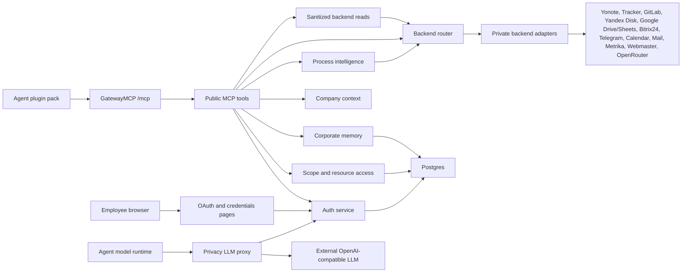

# GatewayMCP Architecture

GatewayMCP is the single boundary between installed agent plugins and company systems. Agents connect only to GatewayMCP, authenticate once through Yandex OAuth/MCP OAuth, receive a Gateway-issued access token, and call a small stable set of public MCP tools.

Backend tokens, user credentials, access rules, audit events, and memory live inside the gateway runtime and Postgres. Agents must not receive upstream service tokens directly.

## Runtime Layers



## Package Map

- `gateway.py` is the compatibility entrypoint for `gateway-mcp`.
- `gateway_mcp/server.py` assembles the FastMCP app and registers routes/tools.
- `gateway_mcp/routes/` contains HTTP routes: health, metrics, OAuth callback, and credentials UI.
- `gateway_mcp/tools/` contains public MCP tools grouped by domain.
- `gateway_mcp/tools/runtime.py` centralizes tool scope checks, audit finish, deny handling, and error audit.
- `gateway_mcp/tools/router.py` returns compact backend data to agents and records resource-access diagnostics in the server audit. Full RBAC subjects, grants, constraints, backend routes, and transport details never enter the agent response; `gateway_request_id` links the response to diagnostics.
- `gateway_mcp/backends/` contains private backend adapters by system.
- `gateway_mcp/services/` contains domain services: auth, access, storage, memory, company context, policy, migrations, observability.
- `gateway_mcp/services/process_intelligence.py` normalizes source-system data into sanitized process events, discovers process candidates, compares them with Yonote, and builds a Process Rebuild Backlog.
- `gateway_mcp/services/telemetry.py` records idempotent assistant skill lifecycle and model-usage events, closes unfinished invocations by session, and rejects prompt, response, result, message, token, and transcript content from telemetry metadata.
- `gateway_mcp/services/approvals.py` implements role/scope assignment, four-eyes checks, expiration, artifact hashes, comments, atomic decisions, payload-bound execution checks, and one-time approval consumption for protected operations.
- `gateway_mcp/services/access_packages.py` defines versioned business roles; storage expands one assignment into linked scope/resource grants and revokes the linked set transactionally.
- `gateway_mcp/services/privacy.py` detects sensitive text, creates actor-bound stable pseudonyms, removes credentials, and restores only approved request pseudonyms after the external model returns.
- `gateway_mcp/routes/llm_proxy.py` exposes buffered OpenAI-compatible Chat Completions and Responses endpoints at `/privacy/v1` without exposing the provider key.
- `gateway_mcp/services/file_transfers.py` keeps binary data outside MCP/LLM context through short-lived upload sessions and one-time download sessions.
- Root modules like `gateway_auth.py` and `gateway_storage.py` are compatibility wrappers only.

## Adding A Backend Route

1. Add the route declaration to `gateway-tools.json`.
2. Reuse an existing `transport` if possible.
3. If a new transport is needed, add an adapter in `gateway_mcp/backends/`.
4. Register dispatch in `gateway_mcp/backends/router.py`.
5. Add or update tests so every declared transport is routed.

Backend route declarations should include scope, backend, operation or path metadata, and argument aliases when useful. Secrets must come from env vars or per-user encrypted credentials, never from the registry.

## Adding A Public MCP Tool

1. Add the tool to the matching file in `gateway_mcp/tools/`.
2. Use `ToolRun.start(...)`.
3. Call `run.require_scope(...)` for required scopes.
4. Call `run.finish(...)`, `run.denied(...)`, and `run.error(...)` through the standard try/except shape.
5. Register the tool file in `gateway_mcp/server.py` if it is a new domain.

Do not call `finish_tool`, `deny`, or `start_timer` directly from tool modules. `tests/test_structure.py` enforces this.

## OAuth And Credentials

Yandex OAuth is the employee login provider. MCP-capable clients such as Claude Code use the standard MCP OAuth flow: protected-resource metadata, authorization-server metadata, client registration, authorization code with PKCE, and token exchange. Dynamic client registration is the default compatibility mode. Client ID Metadata Documents remain implemented but are advertised and accepted only when `GATEWAY_CIMD_ENABLED=true`, because their availability depends on the Gateway being able to retrieve the client's external metadata URL. Agents without MCP OAuth support can use the older `/auth/yandex/login` bearer-token fallback during migration.

GatewayMCP stores user OAuth tokens and per-user app credentials encrypted in Postgres. Upstream tokens never go to agents.

- Yandex OAuth token: Tracker, Yandex Disk, and OAuth-backed routes where available.
- Shared analytics token: Metrika and Webmaster routes use YANDEX_METRIKA_OAUTH_ACCESS_TOKEN (Webmaster falls back to the same token) of an account with representative access to the company counters. Access is granted through the analytics-readers group.
- Google OAuth token: Google Drive and Google Sheets routes use per-user refresh tokens.
- Yandex Calendar: CalDAV uses a per-user app password entered at `/credentials`.
- GitLab: each user enters a personal access token at `/credentials`.

Server-level tokens are disabled by default for user-owned systems. Fallback server tokens require explicit env flags and should be used only for service accounts or migration periods.

GatewayMCP advertises the full supported scope catalog through OAuth metadata so clients can request the capabilities they need. Transport authentication only proves that the Gateway token is valid; real authorization is enforced inside public tools and routed tools through Gateway scopes and resource grants.

## Access Model

Access has two layers:

- Scope access: coarse capability such as `skills:read`, `tools:call`, `gitlab:read`, `access:admin`.
- Resource access: per-system grants such as GitLab project, Yandex Disk path, Tracker queue/issue, Yonote document, Telegram chat.

Scope grants and resource grants live in Postgres and are managed through admin MCP tools, not by editing database rows directly.

Employee onboarding uses a request-and-review flow instead of direct grants:

1. The employee reads their effective profile and the versioned package catalog with `access:request`.
2. The employee explicitly submits one business-role package request with a reason and optional TTL. A request cannot contain arbitrary scopes or resources.
3. A platform administrator reviews the queue with `access:read` and previews the decision.
4. Approval with `access:admin` assigns the existing versioned package and links its grant bundle to the request. Rejection creates no grants.
5. The employee re-authenticates only when the OAuth token must include newly granted scopes; resource grants and package assignments remain server-side in Postgres.

Pending requests are idempotent per employee and package. The stored package version prevents an administrator from approving a materially changed package without a new employee request.

Resource policy mode:

- `permissive`: no matching resource grant means allow.
- `strict`: no matching resource grant means deny.

Denies win over allows when both match.

## Memory Model

Corporate memory has three layers:

- Short memory: session/task summaries with TTL in Postgres.
- Medium memory: project/team/company facts and summaries in Postgres.
- Long memory: source-backed corporate knowledge from Yonote, templates, ADRs, docs, and linked systems.

Long memory should stay source-backed. GatewayMCP searches sources and returns links/results instead of copying the whole company knowledge base into memory rows.

## Company Context

Company context is not maintained in Git. GatewayMCP reads Yonote indexes and linked source systems.

The source-of-truth domains are:

- employees, roles, teams;
- projects and clients;
- processes and playbooks;
- documents;
- decisions and ADRs;
- operational activity.

The canonical index config is `gateway-company-indexes.json`; concrete Yonote page IDs can be injected through env vars.

## Process Intelligence

Process intelligence is a derived, sanitized layer above backend routes. It does not expose raw Bitrix24, Tracker, GitLab, or Yonote records to agents. Instead it returns normalized events with this shape:

```text
system -> event_type -> process_hint -> case_id -> status -> artifact ref -> source_ref
```

The core public tools are:

- `gateway_process_events_search` - collect sanitized process events.
- `gateway_process_candidates_discover` - group repeated event chains into process candidates.
- `gateway_process_compare_with_yonote` - compare candidates with Yonote process pages.
- `gateway_process_rebuild_backlog` - produce staff-reviewed follow-up items.

Hermes uses these tools to identify real operating chains such as sales pipeline, lead qualification, delivery task flow, development review/release, and cross-system handoffs. Yonote remains the official source of truth; the gateway proposes changes and evidence, but does not rewrite process pages automatically.

## Deployment

The GitLab pipeline validates JSON, compiles Python, runs unit tests, builds the Docker image, and deploys manually on `main`.

Production runtime uses:

- Docker Compose on the server;
- Postgres for auth state, credentials, ACL, audit, and memory;
- Postgres assistant telemetry tables for local skill adoption stats;
- `/healthz` for health checks;
- `/metrics` for Prometheus scraping.

The production runner must provide Docker CLI access because image build and deployment both use Docker commands.

Agents can trigger an existing manual GitLab job only through `gitlab.pipeline_jobs.play` after explicit human approval. The route uses the dedicated `gitlab:deploy` scope, validates and consumes a `production_deploy` approval bound to the project and job, records `approval_ref` and `idempotency_key` in the tool-call audit, and can be restricted to individual GitLab project ids with resource action `deploy`. The broader `gitlab:write` scope does not imply deployment access.
